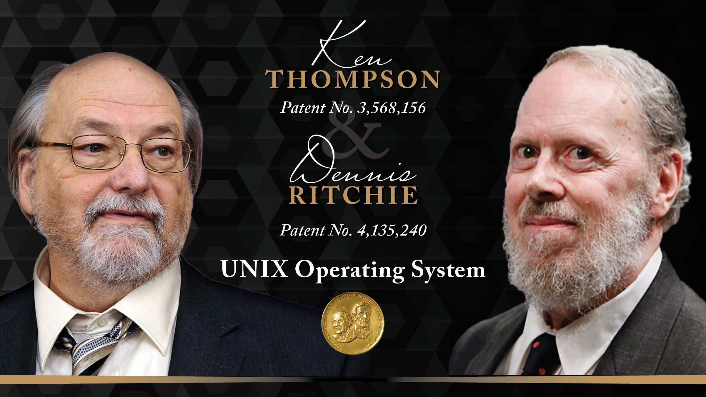
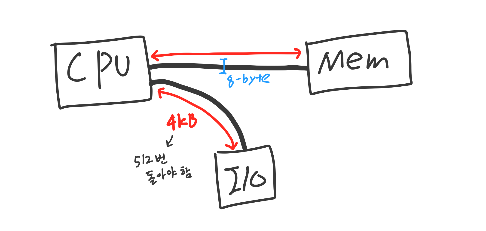
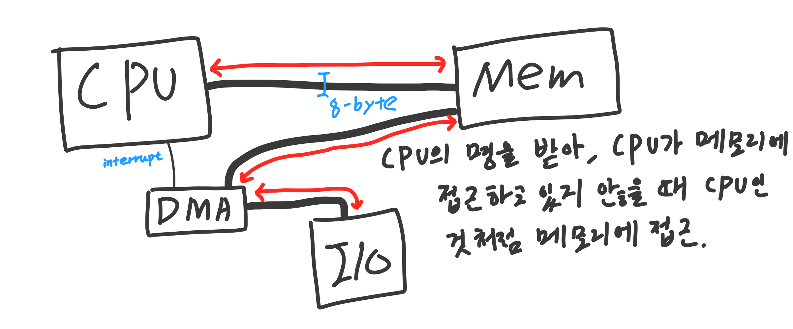

Operating System
=================
# 1. Introduction
> OS is a software that converts hardware into a useful form for applications.

쉽게 말해, 운영체제는 일종의 정부이고 유저 애플리케이션은 정부의 관리와 지원 아래 동작하는 사회 각 기관이다. 

## 운영체제를 바라보는 시각들
### Application View
> OS provides an execution environment for running programs, and an abstract view of the underlying computer system.

참고로 abstraction은 복잡한 구현을 간단하게 보여주는 것이고, virtualization은 애플리케이션에게 실제로 존재하는 것 처럼 보여주는 것이다.

### System View
> OS manages various resources of a computer system.

운영체제는 메모리, I/O 디바이스, 심지어 전력 등의 자원을 다룬다. 여기서 다룬다는 의미는 시간과 공간을 프로세스에게 배분하고, 각 프로세스로부터 다른 프로세스를 보호하며, 공정하게 자원을 분배하는 등의 작업을 효율적으로 한다는 것을 뜻한다.

### Implementation View
> OS is highly concurrent, event-driven software.

운영체제는 동시에 여러 작업을 수행함과 동시에 event-driven, 즉 애플리케이션에서 보내는 system call이나 하드웨어에서 보내는 interrupt 등의 event가 발생했을 때에 돌아가야 한다.

## 운영체제의 역사
우리에게 친숙한 Unix의 역사는 1965년의 Multics로부터 시작된다. Multics는 MULTiplexed Information and Computing Service의 약자로, 그 시절에 굴러가기에는 너무 덩치가 컸지만 hierarchical file system, VM, user-level shell, dynamic linking, PL/I라는 high-level language로 구현되는 등 지금도 사용하는 여러 기술들이 처음으로 소개된 운영체제이다.

Unix는 C를 개발한 **Dennis Ritchie**와 **Ken Thompson**에 의해 개발되었다. Unix는 UNiplexed Information and Computing Service의 약자로, i-node의 도입, process control, pipe를 이용한 IPC, I/O redirection, signal 등의 기능이 추가되었다. Multics보다 가볍고 쉽게 짜였다고 한다. 운영체제의 역사에서의 Unix의 중요성을 모르는 사람이 이 글을 보고 있을 리가 없겠지?

</img> 존나 멋있다 나도 이런 사람들이 되고싶따

# 2. Architectural Support for OS
## Issue 1. I/O

I/O 디바이스와 CPU는 동시에 돌아갈 수 있다. 따라서 I/O 디바이스에 명령을 넣고 이를 기다리는 건 소중한 CPU 자원의 낭비이므로, I/O 디바이스에 명령을 내린 후 디바이스가 이를 완료할 때 까지 CPU는 다른 작업을 하게 해야 한다. 이를 위해 디바이스는 작업을 완료하면 interrupt를 날리고 CPU는 이를 받아 interrupt handler를 실행한다. 

그런데 SSD를 예로 들어 보자. SSD는 아무리 빨라봤자 메모리보다 한참 느리지만, 한 번에 4KB씩 전송이 가능하다. 하지만 메모리는 한 번에 8B씩 전송이 가능하다. 이를 커버하려면 CPU는 512번 왔다갔다 하며 SSD에서 메모리로 load해야 할 것이다. 이 역시 소중한 CPU 자원의 낭비이다. 

</img> CPU가 메모리와 I/O 사이에서 열심히 구르고 있다.

**DMA(Direct Memory Access)**를 사용하여 이를 해결할 수 있다. DMA는 I/O에게는 CPU처럼 동작하여 CPU가 다른 일을 하는 동안 I/O 디바이스와 메모리를 중개한다. I/O 작업이 끝나면 디바이스가 아니라 DMA가 CPU에게 interrupt를 보내 일을 처리했음을 알린다.

</img> DMA가 CPU 대신 메모리와 I/O를 중개해주고 있다.

## Issue 2. Protection

운영체제는 항상 사용자 애플리케이션이 선을 넘는 행동을 하지 않도록 감시해야 한다. 사용자 애플리케이션은 커널을 거치지 않고 하드웨어에 직접 접근할 수 없으며, control register이나 자기 자신에게 허용된 범위를 벗어나는 메모리 범위에 접근할 수 없고, HLT instruction도 실행해서는 안된다. 이러한 명령어들을 **Privileged** 또는 **Protected** instruction이라고 한다. 

이를 위해 운영체제는 2개 이상의 작동 모드를 지원한다. Privileged instruction을 실행할 수 있는 모드는 커널 모드, 그렇지 않은 모드는 유저 모드로 구분한다. x86에서는 Ring 0이 커널 모드, Ring 3이 유저 모드로 구분되며 RISC-V에서는 처음 부팅 시에만 가동되는 Machine 모드를 제외하고, Supervisor가 커널 모드, User이 유저 모드로 구분된다. 유저모드인 상태에서 privileged instruction이 들어오면 권한 오류가 날 것이다. 이 작동 모드는 CPU 내에 현재 작동하고 있는 모드 bit이 존재하여 구분할 수 있다.

## Issue 3. Servicing Requests

유저 애플리케이션이 실행할 수 있는 명령어의 범위에는 한계가 있다고 했다. 그렇다면 권한이 없는 명령어는 어떻게 실행해야 하는가? 이는 **System Call**을 통해 가능하다. System call은 사전에 운영체제 안에 정의되어 있으며, protected procedure call이므로 커널 모드에서 실행된다. 유저 모드에서 System call을 실행한다면 커널 모드로 바뀌어 실행되며, 프로시져를 나갈 때 다시 유저 모드로 바뀌어 나가게 된다. 예를 들어 유저 프로세스에서 printf()를 호출하면, 이는 libc.c에 정의된 write()를 호출하며, write()는 내부에서 system call을 호출하여 커널 모드에서 나머지를 실행하고 유저 모드로 돌아오는 것이다.

System call은 trap에 해당하며 intentional exception이다. x86에서는 INT instruction으로, RISC-V에서는 ecall instruction으로 호출한다. a7 레지스터에 system call number를 저장하여 어떤 종류의 system call인지 알 수 있다. 

| Trap | Faults | Abort |
| ---- | ---- | ---- | ---- |
| Intentional | Unintentional, but possibly recoverable | Unintentional and unrecoverable |
| system calls, breakpoints, special instructions, ... | page faults(recoverable), protection faults(unrecoverable), ... | parity error, machine check, ... |
| returns control to the next instruction | re-execute current instruction or abort | abort | 
    c.f. Exceptions in x86

## Issue 4. Control
커널 코드는 돌아가고 있는 프로세스가 커널에게 CPU를 넘겨주던가(e.g. yield()), system call을 호출하거나, 아니면 하드웨어에서 interrupt가 나야 실행될 수 있다. 바꿔 말하면 프로세스가 CPU를 독점하면서(e.g. 무한 루프) system call을 호출하지 않고 하드웨어에서 interrupt가 나지 않는다면 커널 코드는 영원히 실행될 수 없고, 따라서 context change 등의 유용한 작업을 할 수 없게 된다.

이를 해결하기 위해 가장 쉬운 방법은 프로세스가 스스로 CPU의 사용을 멈추는 것이다! 프로세스가 yield() system call을 호출하면 커널에게 CPU 통제권이 넘어가고, 스케쥴러를 호출하는 등의 작업을 할 수 있게 된다. 이러한 방식은 커널이 유저 애플리케이션을 신뢰할 수 있을 때 유용하다.

하지만 대부분의 경우 커널은 유저 애플리케이션을 신뢰할 수도 없고 신뢰해서도 안된다. 이를 해결하기 위해 하드웨어 레벨에서 **timer**를 설정하여 이를 해결할 수 있다. 하드웨어 timer는 주기적으로 interrupt를 생성해냄으로써, 주기적으로 무조건 OS에게 컨트롤을 쥐어줄 수 있다. 

## Issue 5. Memory Protection
유저 애플리케이션은 하드웨어에 직접 접근할 수 없기 때문에 반드시 커널을 거쳐야 한다. 하지만 메모리만큼은 직접 접근할 수 있다. 메모리마저도 system call을 거쳐 접근한다면 너무 느려지기 때문이다. 하지만 이 경우에도 커널은 유저 애플리케이션을 신뢰할 수 없기 때문에, 각 유저 애플리케이션은 서로로부터 보호되어야 하며, 커널 자체도 유저 애플리케이션으로부터 보호되어야 한다. Virtual Memory는 메모리를 가상화하여 각 프로세스마다 비어있는 가상 메모리 공간을 할당하여 메모리를 보호할 수 있다. **MMU**는 하드웨어 차원에서 메모리 가상화를 지원해준다. 

## Issue 6. Synchronization
프로세스끼리는 서로의 메모리를 볼 수 없지만, 스레드는 가능하다. 따라서 스레드끼리 공유하는 메모리에 모종의 조치를 취하지 않으면 예상치 못한 동작을 할 수 있다. 이를 보호하기 위해서 특별한 **atomic** instructions가 지원된다.

# 3. Process
> Process is **an instance of a program in execution**.

